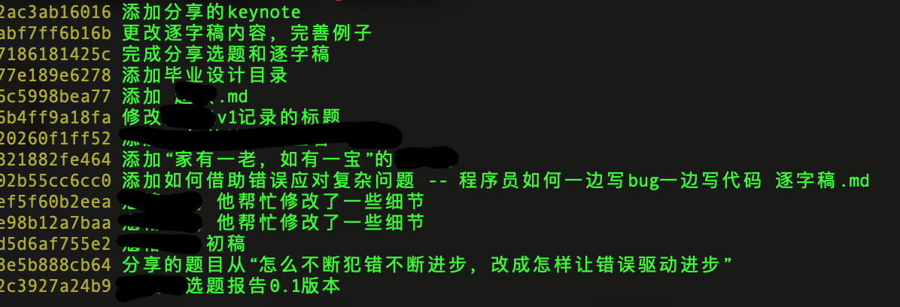
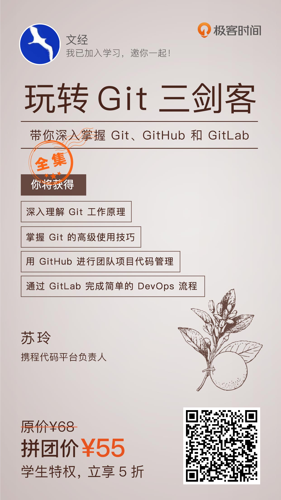

# 一起花10个小时学会git，人间值得

## git 是什么？ 

git是一种版本控制工具，可以把它当做一台时间机器，交给它的每个东西，它都会帮你保存，永远不会丢失。

拿我们的选题分享举个例子，我修改了5次才通过班班的初审。那我怎么保存这份选题的文档？只保存最新的这一份是不够，因为之前被我删除的某些材料可能以后会被用到。那保存5份吗？那就更有问题了，我自己可能都忘记了每一份做了什么修改。

下面这几行输出，是我的“得到大学”这个git项目的提交记录，不论我怎么修改选题的内容，只要我提交到git，都能找回以前历史上的每一次提交。

对个人来说，git可以是知识管理的一个极好的工具。

git更强大的地方在于团队协作。例如这次需要十几个人协作的毕业设计。会产生多少文档，复盘报告会被多少人修改几次，这些修改怎么同步？靠在微信群里传文件且不说每个人都是都会看到。一想到改几个字，就要再同步一次给所有人，都会很痛苦。

## 为什么要学 git？

事实上，十几个人只是非常小的团队规模。Linux之父Linus发明git是为了解决分布在世界范围内几千名Linux内核开发人员的协同问题。所以，如果你掌握git，你至少可以有以下收获：

1. 高效地与他人合作，尤其是开源项目
2. 发起一个开源项目让别人一起来参与
3. 管理好自己知识体系。
4. 掌握一项有点难度的陌生技能，体验和小伙伴们一起“learning by doing”的乐趣。

因此，我们“长征1号”组发起了git学习计划，让每个人小伙伴都注册了一个github账号。通过毕业设计这个项目，顺便把git这个工具学会，你上车不？

## 学习计划

1. 跟着线上视频课程学：["玩转Git三剑客"](https://time.geekbang.org/course/intro/100021601): https://time.geekbang.org/course/intro/100021601, 2人成团55元，如果你是新人，才9.9元。
2. 课程全长大概600分钟，不需要全部学完就能用了。
3. 计划2-3周完成，每周组织一次线上讨论，1对1回答学习过程中遇到的问题。
4. 把自己在得到的学习记录（作业、选题分享）用git管理起来。把小组的毕业项目也用git管理起来，这样，2个月之后，git就会用得很熟练了。

## 下一步怎么做？

1. 下载“极客时间”这个App，（你可以把这个App看作“IT界”的得到App）。
2. 购买这个“git三剑客”这个课程，下面是我的课程推荐码
3. 注册一个github账号，www.github.com
4. 我创建了一个git仓库来存放学习的文档和问题，如果你遇到任何问题，欢迎把问题提交到[这里](https://github.com/lanjing99/DoSomethingTogether/issues/1):https://github.com/lanjing99/DoSomethingTogether/issues/1。我保证回答同学们的每一个疑问。
5. 加一下微信群 

## 问题

1. 我已经用了印象笔记之类的工具，为什么还需要学习git和github？

   就目前我使用的情况看，对比之下有几点：
   * 印象笔记只能管理纯文本的文档，例如想保存一份word文档或者ppt就做不到，可以git用来管理所有类型的文件。

   * 印象笔记，如果这家公司倒闭了，你的数据就丢失了。存放git仓库里的数据可以放在自己电脑上、github服务器、任何电脑上。基本上不会丢失。

   * 印象笔记的协同功能有限，还要收费。git是免费的，github免费版的功能也足够使用了。

   * 在开源社区git是基础工具，学会用这个工具就能很方便参与别人发起的项目。